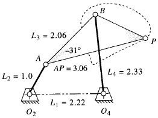

# Mechanism Simulation using (Matlab) Symbolic Math Toolbox.

In this simulation, we will plot the coupler curve generated by point 𝑃 as the link 𝑂2𝐴 rotates. This exercise is based on Chapter 4 of the textbook Design of Machinery: An Introduction to the Synthesis and Analysis of Mechanisms and Machines by Robert L. Norton. We will use MATLAB's symbolic toolbox to construct the four-bar linkage and simulate the motion.

The goal of the exercise is to:
1. Construct the four-bar linkage using vector loop equations.
2. Solve for the angular positions of the coupler and the output link.
3. Track the position of point 𝑃 on the coupler as the crank 𝑂2𝐴 rotates.
4. Plot the path (coupler curve) that point 𝑃 generates over one full rotation of the crank.

When completed, the simulation will be:

Online Lecture:

